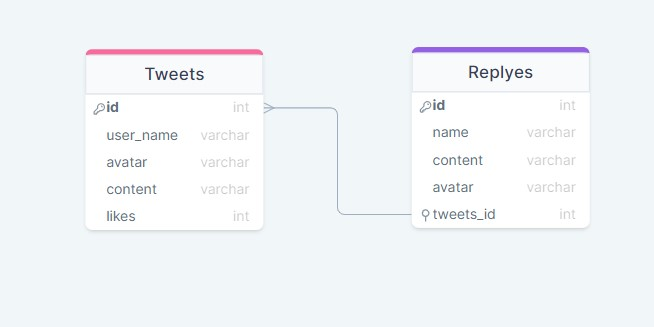

# Twitter
## Description :

Twiiter is a simple website that you can post and interact with message and replaies

## Live Page :
- [GO LIVE](https://tweetsweb.herokuapp.com/)

---

## How to use :

- First you will go in home page 
- you can add tweets from right side 
- you can see the tweets from left side
- you can add your reply in tweets and you can delete the tweets from the buttons 

---

## Installation :
- If you're a git user :
    in you terminal type : `git clone https://tweetsweb.herokuapp.com/`
    then : `cd Twitter`
- If you're not a git user :
  - Click on the 'Code' green button on the right.
  - Click on 'Download ZIP'.
  - You will have the project as ZIP file.
  - Extract the files.

---
## sql ER Diagram :

## Technologies ⚙:
- HTML5
- CSS3
- JS
- NODE.JS
- NPM PACKAGES : Jest , Supertest , Mimetypes , Eslint , Node-fetch , express , nodemon , cross-env , pg , faker-js
- JSON files
- GIt & Github
- Heroku

---

## Team members:
- [Tareq Abu Aqlain](https://github.com/tareq-abuaqlain)
- [Salsabeel Al-Najjar](https://github.com/salsabeelomar)